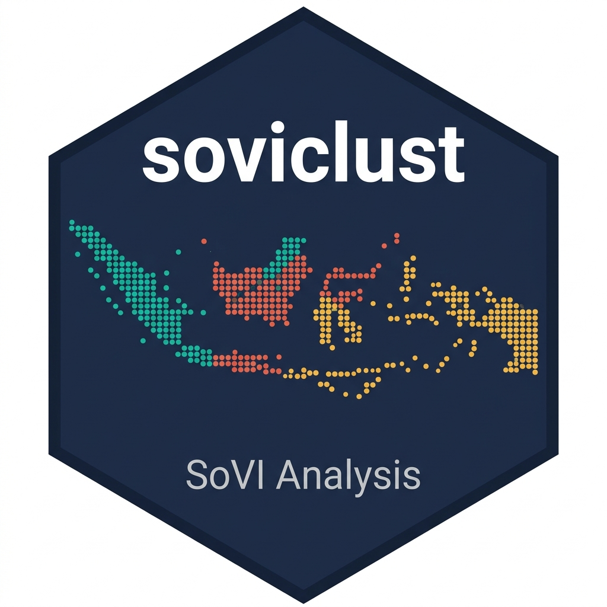

# soviclust 

> **An Interactive R Package for Social Vulnerability Assessment, Spatial Diagnostics, and Fuzzy Geodemographic Clustering**

[](https://cran.r-project.org/)
[](https://www.gnu.org/licenses/gpl-3.0)
[](https://github.com/dedenistiawan/soviclust/tags)
[](https://github.com/dedenistiawan/soviclust/actions/workflows/R-CMD-check.yaml)
[](https://lifecycle.r-lib.org/articles/stages.html)

---

## Overview

**soviclust** is an open-source R package and interactive Shiny application for **Social Vulnerability Index (SoVI) analysis, spatial diagnostics, clustering, and geovisualization**.

The package connects analytical steps that are commonly performed using separate tools into a single reproducible workflow. Users can prepare vulnerability indicators, compare alternative variable-direction rules, compute PCA-based SoVI scores, examine spatial dependence, apply conventional and spatial clustering methods, evaluate fuzzy partitions, assess multi-run stability, visualize results on interactive maps, and export analysis outputs.

`soviclust` can be used through an interactive Shiny interface and is intended for researchers, students, analysts, and practitioners working with geographically referenced socioeconomic or vulnerability data.

> **Development status:** `soviclust` is currently under active research development. The ALFGWC method and the GWO/WOA optimization extensions should be treated as experimental until their methodological validation and benchmarking are formally published.

---

## Why `soviclust`?

Social vulnerability studies often require several separate analytical stages:

```text
Indicator data
    ↓
Variable direction
    ↓
Standardization
    ↓
PCA / dimension reduction
    ↓
SoVI construction
    ↓
Spatial diagnostics
    ↓
Clustering
    ↓
Cluster validation
    ↓
Stability assessment
    ↓
Mapping and interpretation
```

`soviclust` integrates these stages into one interactive research environment.

The package is **not limited to calculating a single composite vulnerability index**. It also supports spatial pattern analysis and geodemographic clustering, allowing users to explore both:

- **how vulnerable an area is**, through SoVI scores; and
- **what type of vulnerability profile an area exhibits**, through clustering.

---

## Key Features

### Social Vulnerability Analysis

- **PCA-based SoVI computation**
  - Z-score standardization
  - Principal Component Analysis
  - Varimax rotation
  - component interpretation
  - proportional PCA-based weighting
  - composite SoVI construction
  - Jenks natural-break classification

- **Variable-direction configuration**
  - Theory-Based
  - Loading Sign
  - Cutter-style direction handling

- **Method comparison**
  - Spearman correlation
  - Kendall correlation
  - Mean Absolute Rank Difference (MARD)
  - Root Mean Square Difference (RMSD)
  - Cohen's kappa

### Spatial Analysis

- Global Moran's I
- Local Indicators of Spatial Association (LISA)
- dominant-component analysis
- component and vulnerability profiles
- sensitivity analysis
- interactive choropleth mapping

### General Clustering

- K-Means
- Fuzzy C-Means (FCM)
- DBSCAN

### Spatial and Geodemographic Clustering

- **ClustGeo** — hierarchical clustering with spatial constraints
- **FGWC** — Fuzzy Geographically Weighted Clustering
- **LFGWC** — Local Fuzzy Geographically Weighted Clustering
- **ALFGWC** — Adaptive Local Fuzzy Geographically Weighted Clustering

### Cluster Evaluation

Depending on the selected clustering method, `soviclust` provides clustering diagnostics including:

- Partition Coefficient (PC)
- Classification Entropy (CE)
- Separation Coefficient (SC)
- Xie-Beni Index (XB)
- IFV and related fuzzy-validity measures
- silhouette analysis for hard cluster assignments
- cluster profiles and membership summaries

### Reproducibility and Stability

- configurable random seed
- repeated independent runs for stochastic optimizers
- summary statistics across runs
- best/worst/median solutions
- execution time and iteration summaries
- validation-index distributions
- convergence visualization

### Visualization and Export

- Leaflet interactive maps
- choropleth maps
- membership maps
- radar charts
- heatmaps
- dimensional-reduction plots
- CSV result export
- high-resolution map export

---

## Methods Implemented

### Social Vulnerability Index

The SoVI workflow follows the general framework introduced by Cutter, Boruff, and Shirley (2003), with extensions implemented in `soviclust` for variable-direction handling, PCA-based weighting, method comparison, spatial diagnostics, and downstream clustering.

For indicator \(x\_{ij}\), standardization begins with:

\[
z*{ij} = \frac{x*{ij} - \bar{x}\_{j}}{s_j}
\]

where \(z\_{ij}\) is the standardized value of indicator \(j\) for spatial unit \(i\).

PCA is then used to identify latent vulnerability dimensions. Retained and rotated components are oriented according to the selected variable-direction strategy and aggregated into the final vulnerability score using the weighting configuration implemented in the application.

Because SoVI construction can be sensitive to methodological decisions, `soviclust` allows users to compare alternative direction rules before selecting the final index configuration.

---

## Clustering Framework

`soviclust` separates clustering into general-purpose and spatially informed approaches.

| Family                       | Method   |         Spatial information          | Fuzzy membership | Metaheuristic optimization |
| ---------------------------- | -------- | :----------------------------------: | :--------------: | :------------------------: |
| General                      | K-Means  |                  No                  |        No        |             No             |
| General                      | FCM      |                  No                  |       Yes        |             No             |
| Density-based                | DBSCAN   | Optional coordinate/distance context |        No        |             No             |
| Spatial hierarchical         | ClustGeo |                 Yes                  |        No        |             No             |
| Spatial fuzzy                | FGWC     |                 Yes                  |       Yes        |            Yes             |
| Local spatial fuzzy          | LFGWC    |             Yes (`dthr`)             |       Yes        |            Yes             |
| Adaptive local spatial fuzzy | ALFGWC   |  Yes (`dthr`, Queen, Rook, Bishop)   |       Yes        |            Yes             |

---

## FGWC and Software Provenance

The FGWC implementation included in `soviclust` was **adapted from source code in the `naspaclust` R package** developed by Bahrul Ilmi Nasution, Robert Kurniawan, and Rezzy Eko Caraka.

The original `naspaclust` software is distributed under the **GNU General Public License version 3 (GPL-3)**. The adapted FGWC source in `soviclust` has been modified and integrated into a broader Shiny-based analytical workflow.

Major modifications and extensions in `soviclust` include:

- integration with the `soviclust` Shiny architecture;
- unified data preparation and parameter configuration;
- integration with SoVI-derived and raw-data inputs;
- cluster validation and profile visualization;
- interactive spatial mapping;
- multi-run stability analysis;
- extension of local-neighborhood options in ALFGWC from `dthr` to **Distance Threshold, Queen, Rook, and Bishop contiguity**;
- integration of additional optimization strategies;
- implementation of **Grey Wolf Optimizer (GWO)** for FGWC-based optimization; and
- implementation of **Whale Optimization Algorithm (WOA)** for FGWC-based optimization.

The use of adapted GPL-3 code is acknowledged here to make the software provenance explicit and reproducible.

---

## Metaheuristic Optimization

FGWC, LFGWC, and ALFGWC provide a common interface for nature-inspired optimization.

Nine metaheuristic optimizers are available in addition to the classic baseline:

| Code      | Algorithm                               | Origin in `soviclust`                              |
| --------- | --------------------------------------- | -------------------------------------------------- |
| `classic` | Classic fuzzy clustering initialization | Baseline                                           |
| `abc`     | Artificial Bee Colony                   | Adapted/integrated from the `naspaclust` framework |
| `fpa`     | Flower Pollination Algorithm            | Adapted/integrated from the `naspaclust` framework |
| `gsa`     | Gravitational Search Algorithm          | Adapted/integrated from the `naspaclust` framework |
| `hho`     | Harris Hawks Optimization               | Adapted/integrated from the `naspaclust` framework |
| `ifa`     | Intelligent Firefly Algorithm           | Adapted/integrated from the `naspaclust` framework |
| `pso`     | Particle Swarm Optimization             | Adapted/integrated from the `naspaclust` framework |
| `tlbo`    | Teaching-Learning-Based Optimization    | Adapted/integrated from the `naspaclust` framework |
| `gwo`     | Grey Wolf Optimizer                     | **Added in `soviclust`**                           |
| `woa`     | Whale Optimization Algorithm            | **Added in `soviclust`**                           |

The inclusion of GWO and WOA represents a **software extension of the optimization options** available for the FGWC workflow. It should not be interpreted as a claim that GWO or WOA themselves were originally developed in `soviclust`.

---

## LFGWC and ALFGWC

### LFGWC

LFGWC extends geographically weighted fuzzy clustering by emphasizing **local spatial relationships** rather than treating all spatial units as globally connected.

In the current `soviclust` implementation, the local neighborhood in LFGWC is defined using a **Distance Threshold (`dthr`)**. Spatial units are treated as neighbors when their inter-unit distance satisfies the selected threshold criterion. The resulting neighborhood structure is then used to construct local spatial weights so that membership information from nearby spatial units can contribute to the clustering process.

This distance-threshold formulation serves as the baseline local-neighborhood mechanism from which ALFGWC is extended.

### ALFGWC

**Adaptive Local Fuzzy Geographically Weighted Clustering (ALFGWC)** is a method developed in `soviclust` as an extension of LFGWC.

ALFGWC extends LFGWC in **two main ways**:

1. it replaces the single global spatial-mixing parameter with an **adaptive parameter \(\alpha_i\) for each spatial unit**, derived from Local Moran's I information; and
2. it expands the neighborhood definition from the LFGWC **Distance Threshold (`dthr`)** rule to a user-selectable set of local spatial structures: **Distance Threshold, Queen contiguity, Rook contiguity, and Bishop contiguity**.

Together, these extensions allow both the **strength of neighborhood influence** and the **definition of neighborhood itself** to vary more flexibly across spatial analyses.

The current implementation first computes the neighborhood-membership component

\[
G*{ik}
=
\sum*{j \in N*i} W*{ij}U\_{jk},
\]

and then updates fuzzy membership as

\[
U*{ik}^{\*}
=
(1-\alpha_i)U*{ik}

- \alpha*i G*{ik},
  \]

where:

- \(U\_{ik}\) is the original membership of spatial unit \(i\) in cluster \(k\);
- \(N_i\) is the neighborhood of spatial unit \(i\);
- \(W\_{ij}\) is a row-standardized spatial weight;
- \(G\_{ik}\) summarizes neighboring membership information; and
- \(\alpha_i \in [0,1]\) controls the strength of neighborhood influence.

Under the **current source implementation**, a larger \(\alpha_i\) gives greater weight to neighboring membership information, while a smaller \(\alpha_i\) preserves more of the unit's original fuzzy membership.

#### Feature-data options

ALFGWC can be applied to several feature representations available in the Shiny workflow:

- original/raw indicator data;
- min-max normalized data \([0,1]\);
- standardized data (Z-score);
- final SoVI scores; or
- rotated-component (RC) scores obtained from the PCA stage.

For fuzzy clustering of variables with different measurement scales, normalized or standardized inputs are generally preferable.

#### Extended neighborhood definition

A second extension introduced in ALFGWC is a more flexible definition of **local spatial neighborhoods**.

While the LFGWC implementation in `soviclust` uses **Distance Threshold (`dthr`)** as its local-neighborhood rule, ALFGWC allows the user to choose among four alternatives:

| Neighborhood option             | Description                                                                                            |
| ------------------------------- | ------------------------------------------------------------------------------------------------------ |
| **Distance Threshold (`dthr`)** | Spatial units are treated as neighbors when their inter-unit distance satisfies the selected threshold |
| **Queen contiguity**            | Polygons are neighbors when they share either an edge or a vertex                                      |
| **Rook contiguity**             | Polygons are neighbors only when they share an edge                                                    |
| **Bishop contiguity**           | Polygons are neighbors when they meet at a vertex                                                      |

This flexibility allows the spatial structure used by ALFGWC to reflect different assumptions about geographic interaction. Distance-based neighborhoods emphasize geographic proximity, whereas contiguity-based neighborhoods use topological relationships between administrative polygons.

For reproducible analysis, users should explicitly report the selected neighborhood rule and, when `dthr` is used, the threshold value applied.

#### Spatial-weighting schemes

Two local weighting schemes are available.

**1. Distance decay**

\[
f*{ij}=\frac{1}{d*{ij}^{\gamma}},
\qquad
W*{ij}=
\frac{f*{ij}}
{\sum*{j\in N_i}f*{ij}},
\]

where \(d\_{ij}\) is the distance between spatial units \(i\) and \(j\), and \(\gamma\) controls the strength of distance decay.

**2. Spatial interaction**

The current implementation uses a population-distance interaction term

\[
\phi*{ij}=\frac{P_j}{d*{ij}},
\qquad
W*{ij}=
\frac{\phi*{ij}}
{\sum*{j\in N_i}\phi*{ij}},
\]

where \(P_j\) is the population of neighboring spatial unit \(j\).

Both schemes are row-standardized so that

\[
\sum*{j\in N_i}W*{ij}=1.
\]

#### Adaptive \(\alpha_i\) mechanism

A user-selected variable is used to compute Local Moran's I. The current implementation then assigns one of three adaptive values:

| Spatial condition                                         | Parameter    | Default |
| --------------------------------------------------------- | ------------ | ------: |
| Significant positive Local Moran's I (\(p<0.05,\ I_i>0\)) | `Alpha High` |     0.8 |
| Significant negative Local Moran's I (\(p<0.05,\ I_i<0\)) | `Alpha Low`  |     0.2 |
| Non-significant or other pattern                          | `Alpha Mid`  |     0.5 |

These defaults are configurable in the Shiny interface. Because \(\alpha_i\) is used as the **neighborhood weight in the current implementation**, users should report the selected alpha rules when publishing ALFGWC results.

#### Optimization and centroid initialization

Classic ALFGWC uses random centroid initialization. Alternatively, the package can use one of the supported metaheuristic algorithms to search for an improved initial centroid configuration before the ALFGWC iteration begins.

The optimization interface exposes algorithm-specific controls such as:

- number of particles/agents;
- convergence/stagnation settings;
- initialization distribution; and
- optimizer-specific parameters.

#### ALFGWC outputs

The Shiny module provides:

- interactive cluster maps;
- maximum-membership maps;
- fuzzy membership matrices;
- cluster profiles;
- heatmap and radar-chart summaries;
- convergence information;
- objective-function values;
- fuzzy cluster-validity indices;
- supplementary silhouette summaries based on hard maximum-membership labels; and
- downloadable clustering outputs.

> **Research status:** ALFGWC is currently under active methodological development. Users are encouraged to report feature scaling, **neighborhood option (`dthr`, Queen, Rook, or Bishop)**, any distance-threshold value, spatial-weighting scheme, Local Moran's I target variable, alpha rules, fuzzifier, optimizer, random seed, and validation results when using ALFGWC in empirical research.

---

## Installation

### Development version from GitHub

```r
# Install remotes if needed
install.packages("remotes")

# Install soviclust
remotes::install_github("dedenistiawan/soviclust")
```

To install a tagged version:

```r
remotes::install_github("dedenistiawan/soviclust@v0.7.0")
```

To avoid upgrading already installed dependencies:

```r
remotes::install_github(
  "dedenistiawan/soviclust",
  upgrade = "never"
)
```

### Local development installation

```r
install.packages("devtools")

devtools::install("path/to/soviclust")
```

> `soviclust` is currently distributed through GitHub. A CRAN release has not yet been announced.

---

## Quick Start

```r
library(soviclust)

# Launch the interactive application
soviclust::run_app()
```

The application opens in the default web browser.

---

## Application Workflow

The Shiny application organizes the analysis into a guided workflow.

| Step | Module                     | Main purpose                                                                          |
| ---: | -------------------------- | ------------------------------------------------------------------------------------- |
|    1 | **Import / Load Data**     | Load user data or bundled example data and connect attribute and spatial information  |
|    2 | **Variable Configuration** | Select vulnerability indicators and define positive/negative vulnerability directions |
|    3 | **Method Comparison**      | Compare alternative variable-direction strategies                                     |
|    4 | **SoVI Computation**       | Standardize indicators, run PCA, construct SoVI, classify and map results             |
|    5 | **Extended Analysis**      | Explore dominant components, Moran's I, LISA, profiles, and sensitivity               |
|    6 | **Cluster Analysis**       | Run general, fuzzy, and spatial clustering methods and evaluate partitions            |
|    7 | **SoVI Analysis**          | Explore indicator- and vulnerability-level spatial patterns                           |
|    8 | **Downloads**              | Export analytical tables and map outputs                                              |

---

## Input Data

### Minimum attribute data

A user-supplied dataset should contain:

- one row per spatial unit;
- a unique spatial-unit identifier;
- numeric indicators used in SoVI or clustering;
- consistent identifiers between attribute and spatial data.

Supported tabular formats include CSV and Excel files where applicable in the Shiny interface.

### Spatial data

For spatial analysis and mapping, polygon geometry must correspond to the same spatial-unit identifiers used in the attribute data.

Spatial clustering may additionally require:

- a population vector;
- centroid coordinates;
- a distance matrix; and/or
- a neighborhood structure, depending on the selected algorithm and spatial-weight configuration.

### Data-quality checks

Before clustering, users should check for:

- missing values;
- duplicated spatial IDs;
- constant indicators;
- mismatches between attribute and spatial IDs;
- invalid geometries;
- incompatible distance-matrix dimensions; and
- inappropriate scaling across clustering variables.

---

## Bundled Example Data

The package includes example data for **514 Indonesian regencies/cities** to demonstrate the SoVI and spatial-clustering workflow.

The vulnerability dataset used in the bundled example is based on the dataset published by **Kurniawan, Nasution, Agustina, and Yuniarto (2022)** in _Data in Brief_:

> Kurniawan, R., Nasution, B. I., Agustina, N., & Yuniarto, B. (2022). Revisiting social vulnerability analysis in Indonesia data. _Data in Brief, 40_, 107743. https://doi.org/10.1016/j.dib.2021.107743

The bundled package files additionally provide supporting inputs required by the interactive workflow, such as population information, coordinates/distances, and administrative geometries where applicable.

The example data are intended for **demonstration, testing, teaching, and reproducibility of the software workflow**. When the bundled Indonesian vulnerability data are used in research, users should cite the original Kurniawan et al. (2022) data paper in addition to citing `soviclust`.

Users conducting new substantive vulnerability assessments should verify:

- indicator definitions;
- reference years;
- administrative boundaries;
- population and spatial-data consistency; and
- the theoretical relevance and direction of each indicator for the study context.

### Dataset citation

```bibtex
@article{kurniawan2022revisiting,
  author  = {Kurniawan, R. and Nasution, B. I. and Agustina, N. and Yuniarto, B.},
  title   = {Revisiting social vulnerability analysis in Indonesia data},
  journal = {Data in Brief},
  volume  = {40},
  pages   = {107743},
  year    = {2022},
  doi     = {10.1016/j.dib.2021.107743}
}
```

---

## Reproducible Analysis

Metaheuristic clustering is stochastic. Results can vary between runs unless random-number generation is controlled.

For reproducible studies:

1. record the `soviclust` version;
2. set and report the random seed;
3. report all clustering and optimizer parameters;
4. report the number of independent runs;
5. retain the spatial-weight definition and neighborhood rule;
6. compare multiple cluster-validity measures rather than relying on a single index; and
7. preserve exported memberships, centroids, objective values, and run summaries.

The stability-analysis module supports repeated runs for FGWC, LFGWC, and ALFGWC and summarizes variability across validation measures.

---

## Interpretation of Fuzzy Clusters

FGWC, LFGWC, and ALFGWC produce **membership values**, not only hard cluster labels.

For spatial unit \(i\):

\[
\sum*{k=1}^{K} U*{ik}=1
\]

A hard cluster label can be obtained from the maximum membership value, but the complete membership vector should be retained whenever possible because it provides information about:

- ambiguous cluster boundaries;
- transitional spatial units;
- overlap between vulnerability profiles; and
- uncertainty in hard cluster assignment.

---

## Software Architecture

At a high level, `soviclust` separates package launching, Shiny modules, shared computational functions, and analysis-specific components.

```text
soviclust
├── R/
│   └── package launcher and exported functions
├── inst/app/
│   ├── ui.R
│   ├── server.R
│   ├── global.R
│   └── R/
│       ├── core/
│       ├── var_config/
│       ├── method_comparison/
│       ├── sovi_computation/
│       ├── extended_analysis/
│       ├── kmeans/
│       ├── FCM/
│       ├── dbscan/
│       ├── cluster_geo/
│       ├── FGWC/
│       ├── LFGWC/
│       ├── ALFGWC/
│       ├── sovi_analysis/
│       ├── downloads/
│       └── shared/
├── inst/extdata/
├── tests/
├── vignettes/
└── man/
```

This modular structure is intended to separate the user interface from reusable computational components and to simplify method development and validation.

---

## Related Software

`soviclust` builds on and complements several established R software ecosystems:

- **naspaclust** provides nature-inspired optimization for FGWC and is the provenance source for adapted FGWC-related code used in `soviclust`.
- **ClustGeo** provides spatially constrained hierarchical clustering.
- **sf**, **spdep**, **tmap**, and **leaflet** support spatial data handling, diagnostics, and geovisualization.
- **ppclust** and related clustering packages provide supporting fuzzy-clustering functionality.
- **findSVI** is related software for Social Vulnerability Index computation.
- **geocmeans** is related software for spatial fuzzy c-means clustering and spatial cluster diagnostics.

The distinguishing aim of `soviclust` is the integration of **SoVI construction, spatial diagnostics, general clustering, spatial fuzzy clustering, optimization, stability assessment, and interactive geovisualization** in one Shiny-based workflow.

---

## Current Scope and Limitations

Users should consider the following when interpreting results:

- SoVI outcomes depend on indicator selection, direction assignment, standardization, PCA decisions, weighting, and classification.
- Spatial clustering results depend on the selected neighborhood definition, distance representation, spatial weights, fuzzifier, cluster count, and optimizer settings.
- Metaheuristic optimization does not guarantee the global optimum.
- Fuzzy and hard-clustering validity indices measure different properties and should be interpreted jointly.
- ALFGWC is under active methodological development.
- GWO and WOA are additional software implementations and require empirical benchmarking before claims of superiority over existing optimizers are made.
- Results should not be interpreted as causal evidence of vulnerability drivers.

---

## System Requirements

| Requirement      | Minimum / recommendation                                           |
| ---------------- | ------------------------------------------------------------------ |
| R                | >= 4.1.0                                                           |
| RAM              | 4 GB minimum; 8 GB or more recommended for larger spatial datasets |
| IDE              | RStudio or Positron recommended but not required                   |
| Operating system | Windows, macOS, or Linux                                           |
| Browser          | Modern browser for the Shiny interface                             |

---

## Testing and Quality Assurance

The repository uses `testthat` and GitHub Actions for automated package checks.

For local development, contributors can run:

```r
# Run package tests
devtools::test()

# Run a full package check
devtools::check()
```

The current automated test suite primarily covers package startup and bundled sample-data integrity. Algorithm-level unit tests for FGWC, LFGWC, ALFGWC, metaheuristic optimizers, convergence behavior, and fuzzy-validity indices are being expanded as part of the research-software validation process.

---

## Documentation

User documentation is distributed through:

- package help pages generated with `roxygen2`;
- vignettes included in the repository;
- module-specific guides such as `Panduan_ALFGWC.md`, which describes ALFGWC input preparation, neighborhood construction, adaptive Local Moran's I settings, optimization parameters, and output interpretation;
- the project website configured in the package metadata; and
- this README for installation, workflow, provenance, and citation guidance.

## Versioning and Changelog

`soviclust` follows semantic versioning for development releases.

See [`NEWS.md`](NEWS.md) for version history and feature changes.

Current README examples refer to version **0.7.0**. Check the latest GitHub tag before reproducing an analysis.

---

## Citation

If you use `soviclust` in research, teaching, or software development, please cite the software:

```bibtex
@software{istiawan2026soviclust,
  author  = {Istiawan, Deden},
  title   = {{soviclust}: An Interactive R Package for Social Vulnerability
             Assessment, Spatial Diagnostics, and Fuzzy Geodemographic Clustering},
  year    = {2026},
  version = {0.7.0},
  url     = {https://github.com/dedenistiawan/soviclust}
}
```

A journal citation should be added here after the `soviclust` software paper is published. If the bundled Indonesian vulnerability dataset is used, cite **Kurniawan et al. (2022)** separately as the original data source.

---

## References

- Chavent, M., Kuentz-Simonet, V., Labenne, A., & Saracco, J. (2018). ClustGeo: An R package for hierarchical clustering with spatial constraints. _Computational Statistics, 33_, 1799–1822. https://doi.org/10.1007/s00180-018-0791-1
- Cutter, S. L., Boruff, B. J., & Shirley, W. L. (2003). Social vulnerability to environmental hazards. _Social Science Quarterly, 84_(2), 242–261. https://doi.org/10.1111/1540-6237.8402002
- Grekousis, G. (2020). _Spatial Analysis Methods and Practice: Describe–Explore–Explain through GIS_. Cambridge University Press. https://doi.org/10.1017/9781108614528
- Kurniawan, R., Nasution, B. I., Agustina, N., & Yuniarto, B. (2022). Revisiting social vulnerability analysis in Indonesia data. _Data in Brief, 40_, 107743. https://doi.org/10.1016/j.dib.2021.107743
- Mirjalili, S., Mirjalili, S. M., & Lewis, A. (2014). Grey Wolf Optimizer. _Advances in Engineering Software, 69_, 46–61. https://doi.org/10.1016/j.advengsoft.2013.12.007
- Mirjalili, S., & Lewis, A. (2016). The Whale Optimization Algorithm. _Advances in Engineering Software, 95_, 51–67. https://doi.org/10.1016/j.advengsoft.2016.01.008
- Nasution, B. I., Kurniawan, R., & Caraka, R. E. (2025). `naspaclust`: Nature-Inspired Spatial Clustering. R package version 0.2.2.
- Wijayanto, A. W., & Purwarianti, A. (2014). Improvement design of fuzzy geographically weighted clustering using Artificial Bee Colony optimization. _2014 International Conference on Information Technology Systems and Innovation (ICITSI/CITSM)_. https://doi.org/10.1109/CITSM.2014.7042178

---

## Contributing

Contributions, bug reports, reproducibility checks, documentation improvements, and method-validation studies are welcome.

A typical contribution workflow is:

```bash
git clone https://github.com/dedenistiawan/soviclust.git
cd soviclust
git checkout -b feature/your-feature
```

After making changes:

```bash
git add .
git commit -m "feat: describe your change"
git push origin feature/your-feature
```

Then open a pull request on GitHub.

For bug reports or feature requests, use the repository's **Issues** page.

When contributing to FGWC-derived source files, please preserve the relevant GPL-3 provenance and attribution notices.

---

## Reporting Issues

A useful bug report should include:

- `soviclust` version;
- R version and operating system;
- module and algorithm used;
- parameter configuration;
- reproducible example or sample data where possible;
- random seed for stochastic algorithms;
- complete warning/error message; and
- expected versus observed behavior.

---

## Author

Developed and maintained by **Deden Istiawan**.

- ITESA Muhammadiyah Semarang
- GitHub: `@dedenistiawan`
- Email: `dedenistiawan@gmail.com`

---

## License

`soviclust` is distributed under the **GNU General Public License version 3 (GPL-3)**.

Portions of the FGWC-related implementation were adapted from the GPL-3-licensed `naspaclust` R package by Bahrul Ilmi Nasution, Robert Kurniawan, and Rezzy Eko Caraka and subsequently modified and integrated into `soviclust`.

See the repository license and source-file attribution notices for details.

---

## Acknowledgements

`soviclust` benefits from the R open-source ecosystem and from the methodological contributions of researchers working on social vulnerability, fuzzy clustering, spatial clustering, spatial statistics, and nature-inspired optimization.

If you use this software in a publication, please cite both `soviclust` and the original methodological references relevant to the analyses you use.
